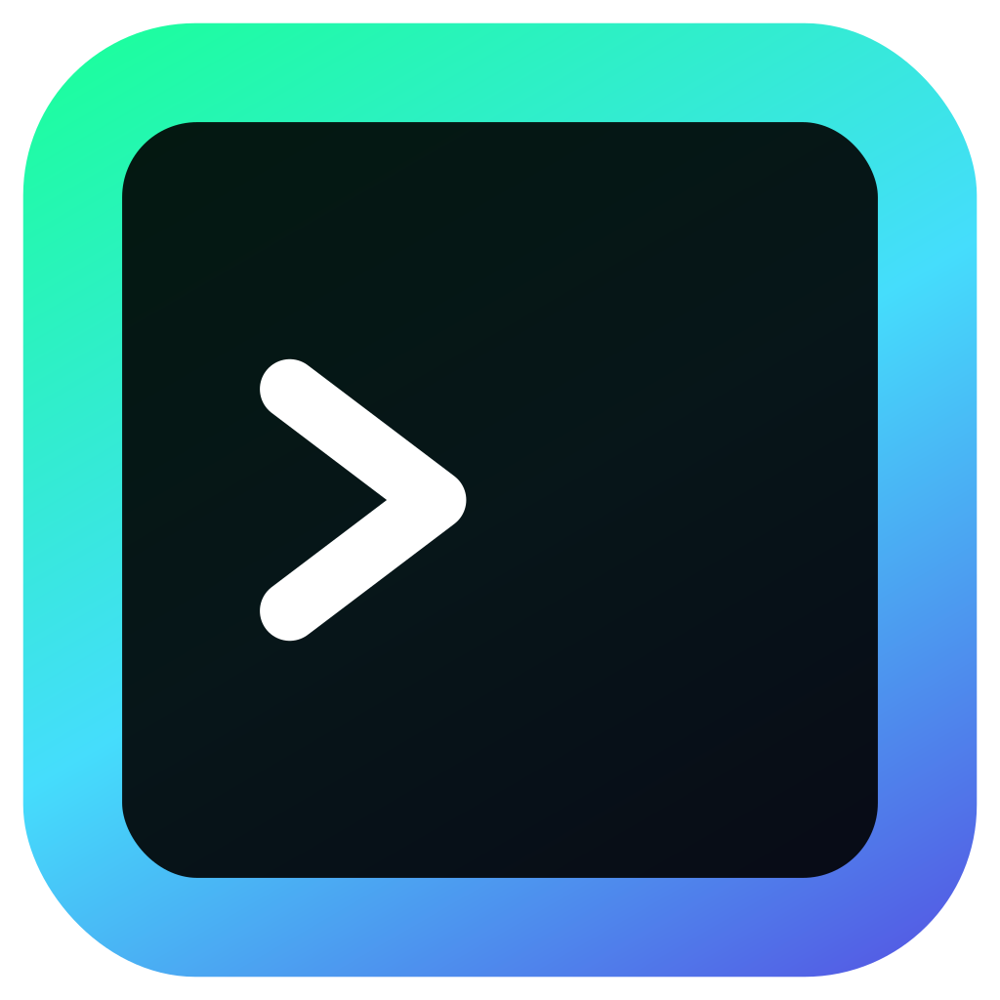

<h3 align="center" >
  <div>
    <a href="https://github.com/nickesc/input-terminal"></a>
    <a href="https://github.com/nickesc/input-terminal/actions/workflows/ts-tests.yml"></a>
    <br>
    <a href="https://www.npmjs.com/package/input-terminal"></a>
  </div>
  <br>
  
  <h3 align="center">
    <code>input-terminal</code>
  </h3>
  <h6 align="center">
    by <a href="https://nickesc.github.io">N. Escobar</a> / <a href="https://github.com/nickesc">nickesc</a>
  </h6>
  <h6 align="center">
    Turn any <code>HTMLInputElement</code> into a terminal interface
  </h6>
</h3>

<br>

## About `input-terminal`

`input-terminal` allows you to turn any `HTMLInputElement` into a terminal interface. Define custom commands that can be executed by users, track command history, autocomplete commands, and more.

## Install

Install `input-terminal` via NPM:

```sh
npm i input-terminal
```

Import the `Terminal` and `Command` classes in your TypeScript or JavaScript file:

```ts
import { Terminal, Command } from "input-terminal";
```

## Basic Usage

The example below demonstrates how to instantiate a new `Terminal`, create a new `Command`, and add it to the `Terminal`'s command list.

```ts
import { Terminal, Command } from "input-terminal";

// Get the input element from your HTML
const input = document.getElementById("terminal") as HTMLInputElement;

// Create a new terminal instance
const terminal = new Terminal(input);

// Create and add a command
const say = new Command("say", (args, options, terminal) => {
    alert(args[1] ?? "nothing");
});
terminal.commands.add(say);

// Initialize the terminal
terminal.init();
```

## Reference

For full documentation of the module and its methods, please see the [Documentation](https://nickesc.github.io/input-terminal).

## License

`input-terminal` is released under the **MIT** license. For more information, see the repository's [LICENSE](/LICENSE) file.

<a href="https://github.com/nickesc/input-terminal/blob/main/LICENSE"></a>
